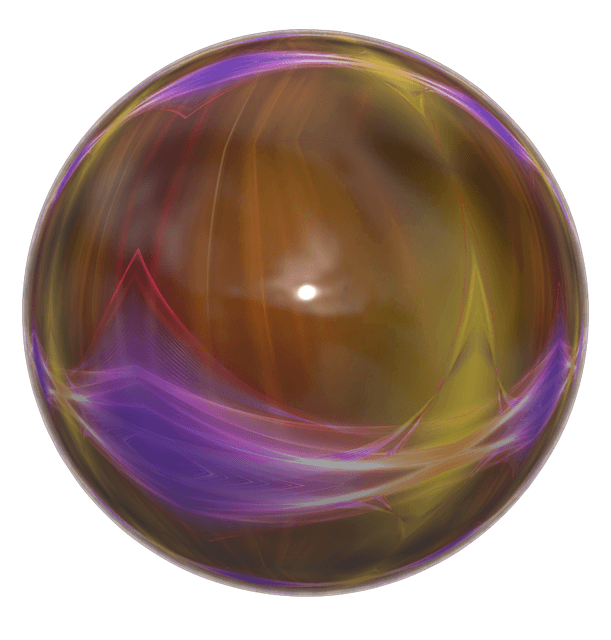

<!-- <h1 align="center">Moonjump</h1> -->

# Moonjump

Moonjump redirects you to a random page harvested from [are.na](https://are.na) and [Hacker News](https://news.ycombinator.com).

## Usage

### Are.na

A dictionary of the channels that are currently being used can be found at the top of `lib/arena.py`

Note that since the are.na api is paginated, the dictionary of channels is weighted by the number of pages in the channel. Channels with the most pages are more likely to be selected.

### Hacker News

HN is in the works...

## Contributing

If you want to contribute, please DM me or open a pull request. Things may be added or changed as needed.

## TODO

- Bookmarklet
- Extension
- Hammerspoon Spoon
- Easy config
