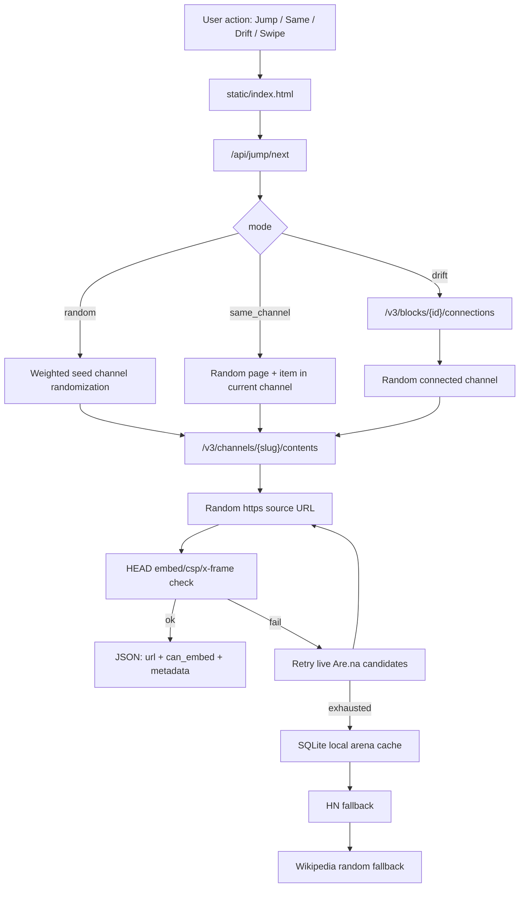
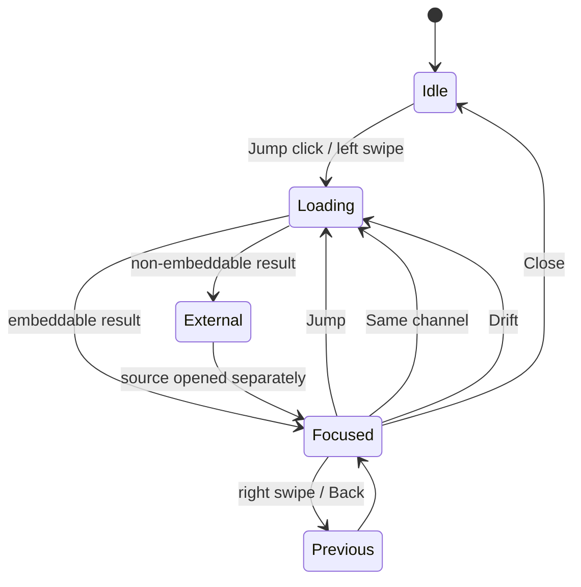
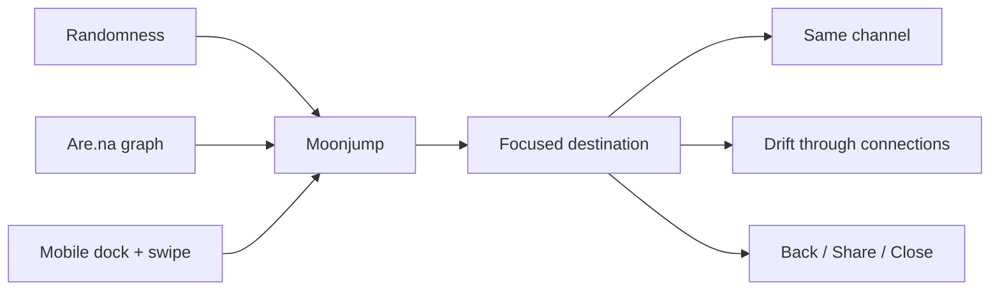

# Moonjump Are.na V3 Random Jump Session

Timestamp: `20260425-101725`

Primary focus detected: replacing Moonjump's static/v2-era discovery path with a live Are.na v3-backed random jump system while preserving the product's core randomness and adding mobile-first steering actions.

## Session Arc

The session began as a product and architecture question: Moonjump felt too static, and the user wanted to use the Are.na v3 API while borrowing lessons from the `feeder` repo's Are.na/taste graph and mobile design work. The initial analysis found that Moonjump already had a strong identity and a working local jump pool, but its discovery mechanism was largely static: a SQLite database of URLs plus old v2 Are.na scripts and routes.

Two subagents analyzed `feeder`. Their reports reframed the target: do not turn Moonjump into a full feed or card wall. Instead, borrow Feeder's cursor/session idea and mobile action discipline. The user then clarified the key constraint: jumps should remain random. That became the central design principle for the implementation.

The resulting work moved Moonjump from "static random URL picker" toward "live random discovery with optional constrained-random steering." Normal `Jump` remains random. `Same` randomly samples within the current Are.na channel. `Drift` randomly samples a connected channel discovered through the current block's Are.na connections. The UI gained mobile affordances, source metadata, and swipe gestures, but the core object stayed a single focused destination.

## Files Explored

Moonjump files read or analyzed:

- `README.md`: product description, usage model, current Are.na/HN routes, TODOs.
- `app.py`: Flask routes, `/jump`, old `/old_jump`, `/arena`, `/hn`, `/search`, embed checks, fallbacks.
- `lib/arena.py`: old v2 weighted channel picker and random item selection.
- `lib/search.py`: Marginalia random/search integration.
- `lib/db.py`: SQLite jump pool, `can_jump` cache, non-jumpable marking.
- `lib/helpers.py`: old random page and weighted choice helpers.
- `lib/hn.py`: HN fallback source.
- `scripts/scrape_arena.py`: old v2 bulk scraper and CSV metadata extraction.
- `scripts/init_db.py`: old CSV-to-SQLite import flow.
- `static/index.html`: portal UI, iframe result surface, buttons, search, share, haptics.
- `static/assets/css/hack.css`: toolbar, iframe, modal, loading, responsive styles.
- `static/assets/css/main.css`: global terminal-like visual language.
- `static/assets/css/dots.css`: animated portal/dot visual.
- `vanilla/index.html` and `vanilla/jump.js`: earlier client-only v2 Are.na random jump experiment.
- `requirements.txt`: Flask and request dependencies.
- `lib/sites.db`: inspected schema, row counts, channel distribution, and sample URLs.

Feeder files analyzed by subagents:

- `/Users/y1s/Documents/repos/feeder/app/lib/api/arena.ts`: Are.na v3/v2 client, normalization, v3 channel contents, block connections, v2 search seed fallback.
- `/Users/y1s/Documents/repos/feeder/app/lib/hooks/use-feed.ts`: feed session, cursor pool, seen URLs, cursor rotation.
- `/Users/y1s/Documents/repos/feeder/app/lib/api/types.ts`: normalized block/session/path types.
- `/Users/y1s/Documents/repos/feeder/app/lib/data/index.ts`: static taxonomy/channel/user graph.
- `/Users/y1s/Documents/repos/feeder/app/lib/data/scoring.ts`: curator trust, freshness, connection count, diversity penalty.
- `/Users/y1s/Documents/repos/feeder/app/lib/auth/arena-auth.ts`: OAuth PKCE flow.
- `/Users/y1s/Documents/repos/feeder/app/components/feed/Feed.tsx`: infinite-scroll sentinel and filter bar.
- `/Users/y1s/Documents/repos/feeder/app/components/wander/Wander.tsx`: focused wander mode, mobile dock, connected paths.
- `/Users/y1s/Documents/repos/feeder/app/components/wander/SwipeContainer.tsx`: horizontal gesture thresholds.
- `/Users/y1s/Documents/repos/feeder/app/styles/globals.css`: compact tokenized visual system.
- `/Users/y1s/Documents/repos/feeder/app/tailwind.config.js`: token mapping.
- `/Users/y1s/Documents/repos/feeder/app/components/feed/BlockCard.tsx`, `TagFilter.tsx`, `ModeToggle.tsx`, `TagBadge.tsx`, `CuratorPill.tsx`: reusable UI primitives.

External docs and live probes:

- Are.na v3 API overview: `https://www.are.na/developers/explore`
- Are.na v3 search endpoint: `https://www.are.na/developers/explore/search/search`
- Are.na v3 block connections endpoint: `https://www.are.na/developers/explore/block/connections`
- Live v3 channel contents probe: `https://api.are.na/v3/channels/internet-escape/contents?page=1&per=2`

## Patterns Discovered

### Moonjump Product Pattern

Moonjump's durable product shape is not a feed. It is a jump surface:

- One primary action.
- One focused destination.
- A strong portal/terminal visual identity.
- Randomness as a product promise, not an implementation accident.
- Optional steering should constrain the random pool, not replace random selection.

### Old Moonjump Discovery Pattern

The previous Are.na model was:

1. Choose a weighted channel from a hard-coded dictionary.
2. Pick a random page number in the v2 channel API.
3. Fetch a large page.
4. Pick a random item with `source.url`.
5. Redirect or embed.

The current `/jump` path had already shifted toward a SQLite pool, so Are.na was present as historical source material but not as a live dynamic experience.

### Feeder Pattern Worth Borrowing

Feeder's useful abstraction is not the UI itself but the "session/cursor" mental model:

- Discovery can keep a set of channel cursors.
- Blocks can expand into connected channels.
- A user can move through origins like `curated`, `personal`, and `search`.
- Seen block IDs and canonical URLs can prevent repetition.

For Moonjump, the immediate implementation borrowed the idea as "constrained random modes" rather than a full feed session.

### Feeder Pattern Not Worth Copying

Feeder's masonry/cards are wrong for Moonjump. They present Are.na items as browseable cards, while Moonjump's core object is the actual destination page. The better mobile UI pattern was Feeder's bottom dock and horizontal swipe discipline.

## Architecture Implemented

## Code Implemented Or Modified

### `lib/arena.py`

Replaced the v2-era Are.na module with a v3-aware client:

- `ARENA_API_BASE = "https://api.are.na/v3"`
- Optional bearer token via `ARENA_TOKEN`.
- Seed channel table with weights and fallback page counts.
- v3 request helper with JSON/error handling.
- Block/channel normalization into Moonjump-friendly dictionaries.
- Random page selection based on v3 channel length when available.
- `Arena.random_jump()`: normal weighted random behavior.
- `Arena.random_from_channel(slug)`: constrained random same-channel behavior.
- `Arena.drift_jump(block_id)`: fetches connected channels for a block, picks a random channel, then picks a random item.
- `Arena.get_jump(mode, channel_slug, block_id)`: mode router for random, same-channel, and drift.

Key implementation principle: every mode still performs random sampling. The modes only choose the random pool.

### `app.py`

Added a richer jump response path:

- `check_embeddable(link)`: centralized HEAD check for HTTPS, status, X-Frame-Options, and CSP `frame-ancestors`.
- `serialize_jump(candidate)`: returns `url`, `can_embed`, and metadata.
- `live_arena_jump_payload(...)`: tries live v3 Are.na several times.
- `local_db_jump_payload(...)`: uses old SQLite cache fallback and marks failed embed candidates non-jumpable.
- `build_jump_payload()`: mode parsing and fallback chain.
- `/jump`: now returns the richer payload.
- `/api/jump/next`: new endpoint for front-end controls and gestures.

Fallback order:

1. Live Are.na v3.
2. Local SQLite URL cache.
3. Hacker News.
4. Wikipedia random.

### `static/index.html`

Added a richer mobile/action layer:

- Source metadata badge surface.
- Edge swipe zones.
- `Back`, `Same`, and `Drift` buttons.
- In-memory jump history.
- Current jump state.
- Metadata-aware share title.
- Same-channel and drift calls into `/api/jump/next`.
- Horizontal swipe handling:
  - left = random next jump
  - right = previous jump

### `static/assets/css/hack.css`

Added compact design tokens and mobile affordances:

- `--mj-surface`, `--mj-border`, `--mj-text`, `--mj-radius`, `--mj-ease`.
- Source/channel badge styling.
- Edge swipe zones with `touch-action: pan-y`.
- Disabled button states.
- Mobile icon-only buttons except the primary Jump action.
- Safe-area-aware bottom dock positioning.

### `lib/db.py`

Fixed an existing bug where the exception variable `e` was referenced outside its `except` binding.

## Architectural Insights

### Randomness Should Be Preserved As The Contract

The user explicitly clarified that jumps must continue to be random. This eliminated heavy ranking, deterministic session order, and feed-like progression as first-class behaviors. Instead:

- `Jump` is random across weighted seed channels.
- `Same` is random within the current channel.
- `Drift` is random through a connected channel chosen from the current block's graph.

This makes the graph useful without making Moonjump algorithmic in the familiar feed sense.

### Live V3 Should Be Anonymous-First

The Are.na v3 docs and Feeder code both revealed that v3 search is Premium/auth dependent. Therefore, the implementation avoids relying on v3 search for normal anonymous jumping. It uses public v3 channel contents and block connections instead. Authenticated/personal taste can be added later, but it is not required for the core product.

### Feeder's "Taste Graph" Is Mostly Static And Shallow

The feeder repo has a strong discovery architecture, but not a learned user taste graph. Its personalization is based on:

- static channel/user/tag graph;
- curator trust heuristics;
- recent authenticated user channels;
- v2 search seeds expanded through v3 connections.

That makes it a useful reference for architecture and UI, but not something to copy wholesale.

### The Best Mobile Pattern Is A Dock Plus Swipes

Feeder's mobile dock translated well to Moonjump. CSS masonry, hover reveals, and card grids did not. Moonjump should privilege thumb-scale actions around a single immersive surface.

## Edge Cases Identified

- v3 `/search` is Premium/auth dependent, so anonymous Moonjump should not depend on it.
- API calls can fail under sandboxed/no-network conditions; local DB fallback remains important.
- Many destination sites block iframe embedding via X-Frame-Options or CSP.
- HEAD requests can fail or lie; current behavior marks local DB candidates non-jumpable if the HEAD check fails.
- Are.na channel pages may contain non-link blocks, image-only blocks, channels, or blocks with missing `source.url`.
- A random page can return no usable HTTPS links, so the client retries multiple pages/candidates.
- Drift can find no public connected channels, so it falls back to normal random.
- Horizontal swipe must not fight vertical scrolling or iframe interaction; edge zones and thresholds reduce this risk but do not perfectly solve iframe event capture.
- The old local database schema is minimal and cannot preserve richer Are.na metadata.
- `.DS_Store` was already modified earlier in the session and was deliberately ignored.
- Flask server bind required escalated permission in the sandbox.

## Decisions Made

| Decision | Rationale |
|---|---|
| Keep `Jump` random | User explicitly requested it; randomness is Moonjump's product identity. |
| Add `Same` and `Drift` as constrained-random modes | Gives user control without turning discovery into a deterministic feed. |
| Use v3 channel contents and block connections first | These endpoints support live public graph traversal without v3 search auth requirements. |
| Keep SQLite fallback | Live APIs and embed checks are brittle; the existing cache protects the core experience. |
| Avoid copying Feeder's masonry/card UI | Moonjump is about landing on destinations, not browsing cards. |
| Borrow Feeder's mobile dock and swipe discipline | Directly improves mobile interaction while preserving Moonjump's identity. |
| Return metadata from jump APIs | Enables source badges, same-channel, drift, and better sharing. |
| Leave auth/personalization for later | It would add credential/session complexity before the anonymous core is stabilized. |

## Questions Raised But Unresolved

- Should Moonjump eventually support Are.na OAuth login for personal channels and private/closed-channel access?
- Should local SQLite storage be migrated to a richer schema with block IDs, channel IDs, curator metadata, ETags, and last-seen timestamps?
- Should the app maintain a server-side jump session instead of only client-side history?
- Should non-embeddable destinations be opened automatically or shown with an explicit "Open" action?
- Should the static seed channel weights be configurable from a data file instead of hard-coded?
- Should v2 search remain available as a topic seed path, as in Feeder, for future query-driven discovery?
- Should drift prefer high-connection channels, fresh channels, or remain uniformly random over connected channels?
- Should the app support keyboard shortcuts for Jump, Same, Drift, Back, and Open?
- Should live v3 responses be cached using ETag/If-None-Match to reduce rate-limit pressure?

## Verification Performed

Commands/checks run during the implementation:

- `venv/bin/python -m py_compile app.py lib/arena.py lib/db.py`
- Inline JavaScript parse check using Node over `<script>` blocks in `static/index.html`.
- `git diff --check`
- Live v3 probe: `/v3/channels/internet-escape/contents?page=1&per=2` returned `200`.
- Live Python Are.na client check returned a random `internet-escape` item.
- Flask test client check for `/api/jump/next`.
- Live local server checks:
  - `/` returned `200`.
  - `/api/jump/next?mode=random` returned `200` with `arena:v3` metadata.
  - `/api/jump/next?mode=same_channel&channel=internet-escape` returned `200` with `arena:v3` and `internet-escape`.
  - `/api/jump/next?mode=drift&block_id=9511561` returned `200` and a connected-channel result.

## Current Product Model

The crystallized model: Moonjump is a random portal with graph-aware steering. It should feel like stumbling, not scrolling.
